# JobHunter

JobHunter es una plataforma para la gestión y búsqueda de empleos, que incluye funcionalidades para usuarios, empresas y administradores. Este repositorio contiene capturas de pantalla de diferentes secciones y características de la aplicación.

## Índice
1. [Inicio](#inicio)
2. [Login](#login)
3. [Registro](#registro)
4. [Perfil de Usuario](#perfil-de-usuario)
5. [Perfil de Empresa](#perfil-de-empresa)
6. [Tienda](#tienda)
7. [Panel de Control de Empresa](#panel-de-control-de-empresa)
8. [Detalles](#detalles)
9. [Dashboard del Administrador](#dashboard-del-administrador)
10. [Servidor y Prisma Studio](#servidor-y-prisma-studio)

---

### Inicio
**Vista principal de la plataforma con un carrusel de empleos destacados.**

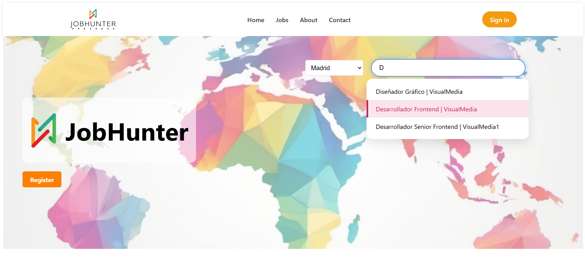

### Login
**Pantalla de inicio de sesión para acceder a la plataforma.**

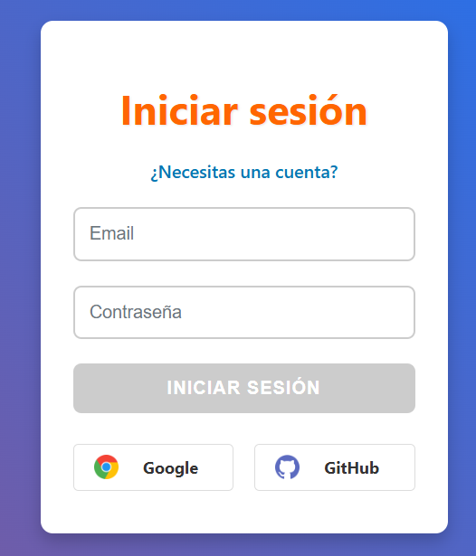

### Registro
**Pantalla para crear una nueva cuenta en JobHunter.**

### Perfil de Usuario
**Vista del perfil personal del usuario registrado.**

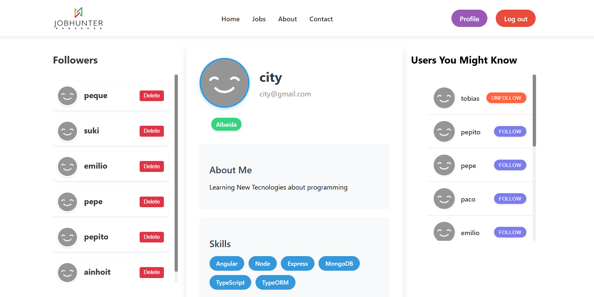

### Perfil de Empresa
**Vista del perfil de una empresa registrada, con opciones para editar la información.**

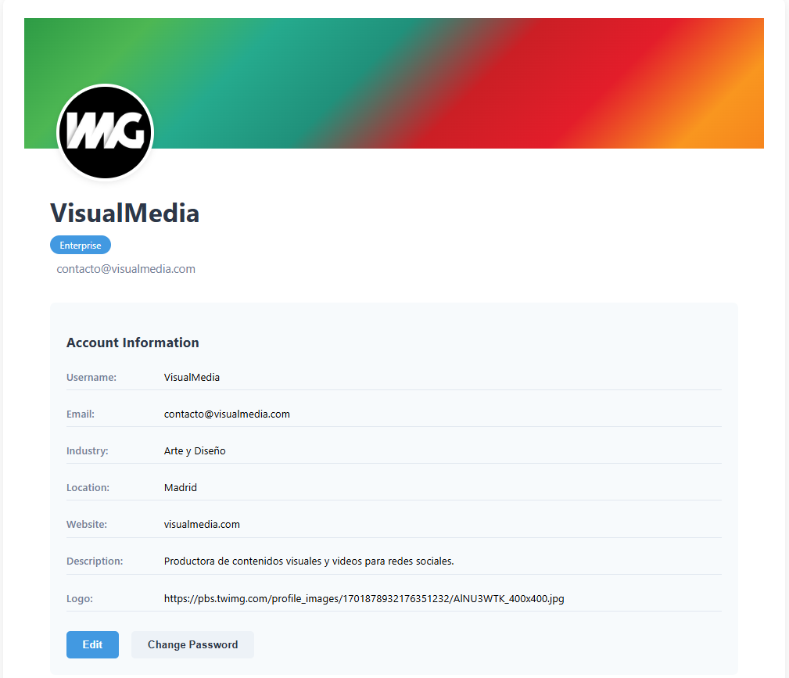
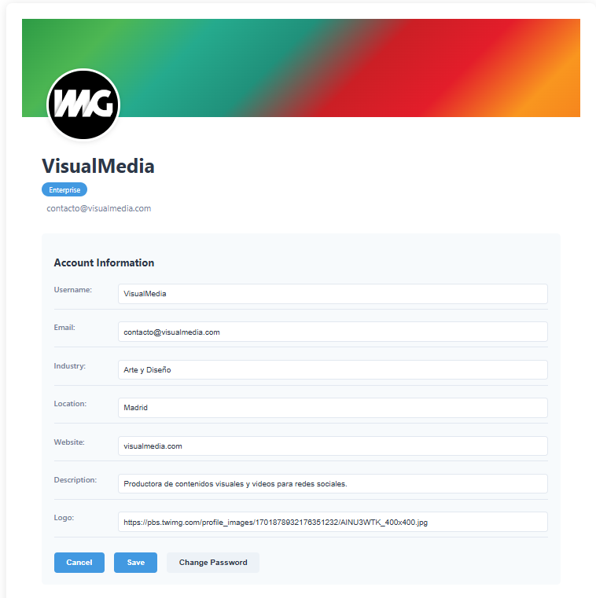

### Tienda
**Vista de la tienda, con opciones de paginación y desplazamiento al principio de la página.**

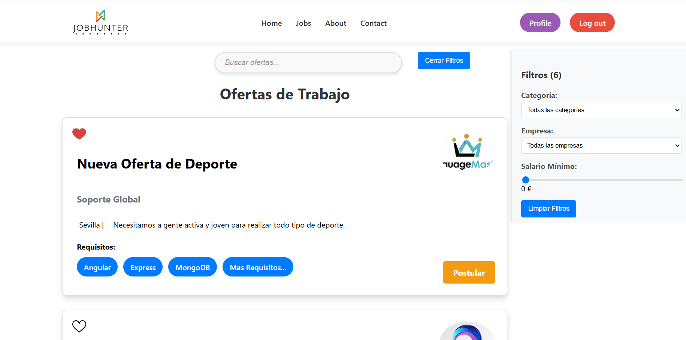
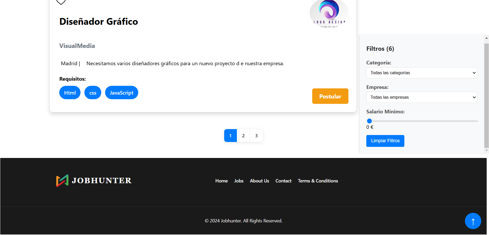

### Panel de Control de Empresa
**Interfaz para que las empresas gestionen sus ofertas de empleo.**

- **Crear nueva oferta:**
  
  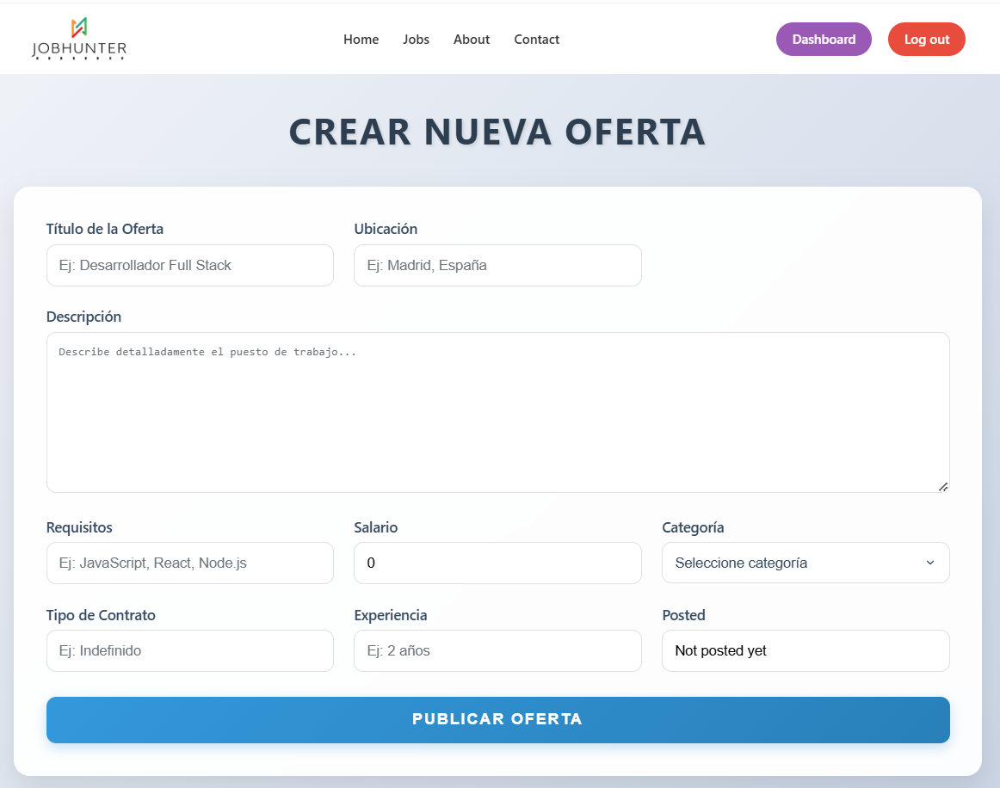

- **Editar una oferta existente:**

  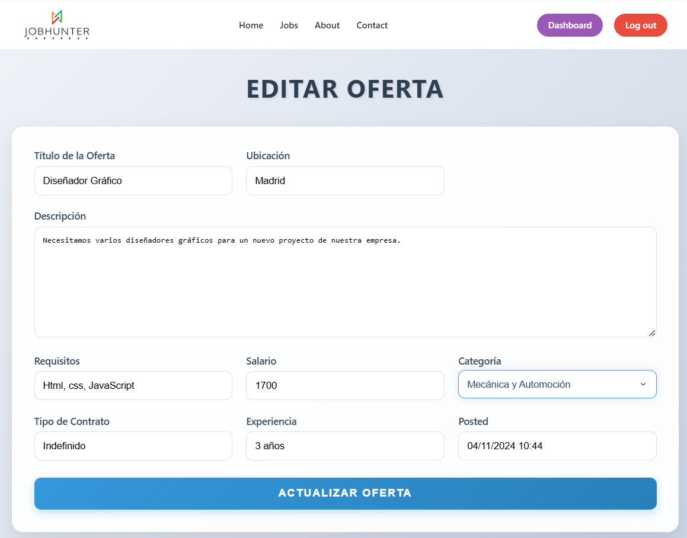

- **Vista general del panel:**

  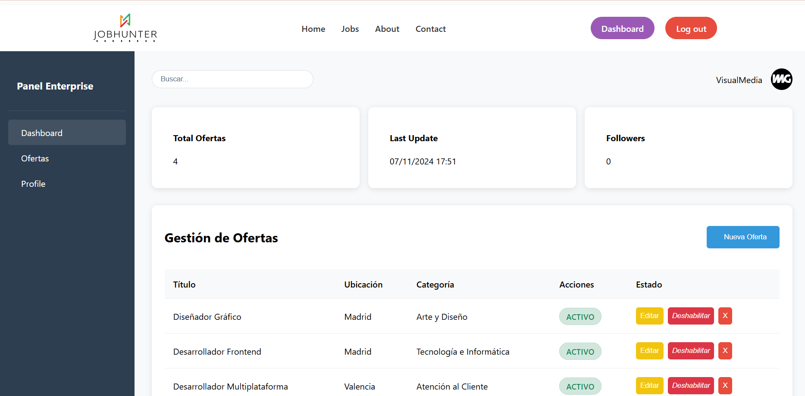

### Detalles
**Página de detalles de una oferta de empleo, incluyendo la sección de comentarios.**

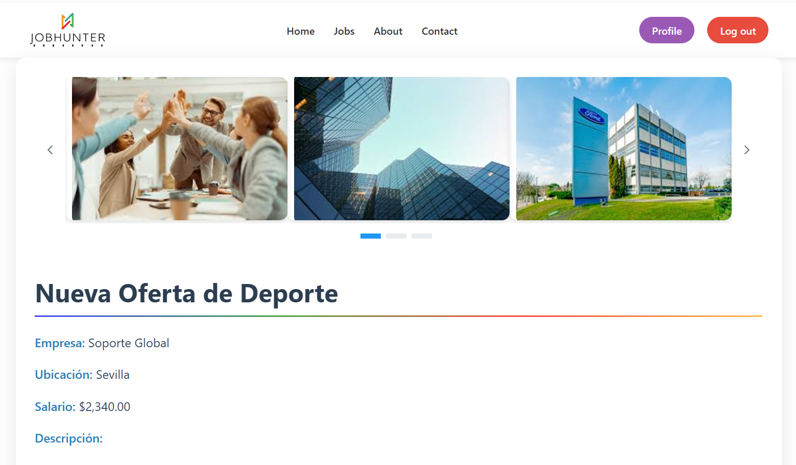
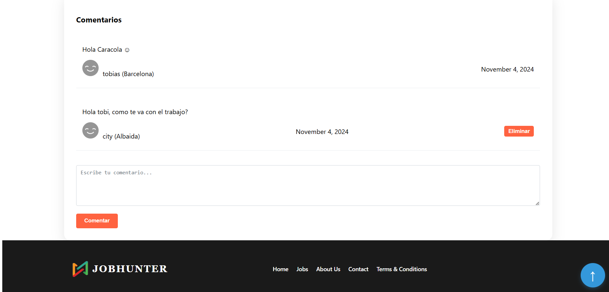

### Dashboard del Administrador
**Vista del panel de administración para la gestión avanzada de usuarios y ofertas.**

### Servidor y Prisma Studio
**Vista de la configuración del servidor y la administración de la base de datos con Prisma Studio.**

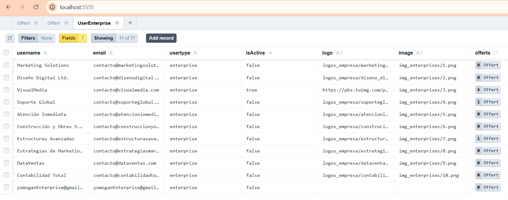

---

## Licencia
Este proyecto está licenciado bajo los términos de la [Licencia MIT](LICENSE).

---

> **Nota**: Las imágenes sirven para ilustrar el diseño y la funcionalidad de cada parte de la aplicación JobHunter.
